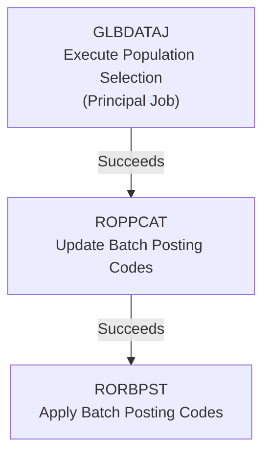

# Job Chaining: Automating Sequential Banner Financial Aid Workflow

This repository provides a sample set of pipelines demonstrating how to use **Job Chaining** to automate the execution of multiple Banner batch jobs in sequence.

**A Job Chain automates execution of multiple jobs by defining a sequence of jobs and the execution conditions that determine when each downstream job runs.** A Job Chain contains one **principal job**, which starts the chain and can optionally be scheduled, and one or more **downstream jobs**, each configured with an execution condition (Succeeds, Fails, or Succeeds or Fails) that determines whether it executes based on the outcome of the previous job.

In this example, the Job Chain automates a common Banner Financial Aid workflow: identify a population of students, determine which Batch Posting Codes should be assigned, and then apply those posting codes to the student records.

---

## Business Process

Financial Aid offices frequently need to identify a population of students and automatically assign Banner Batch Posting Codes based on institutional business rules.

Examples include:

- FAFSA received
- Pell eligibility
- Scholarship eligibility
- Other Financial Aid processing requirements

The workflow consists of three Banner jobs, chained together so each one runs only after the previous one succeeds:

1. **GLBDATAJ** *(principal job)* – Executes the configured Population Selection (PopSel) to extract the population to be processed
2. **ROPPCAT** *(downstream job)* – Updates Batch Posting Codes
3. **RORBPST** *(downstream job)* – Applies Batch Posting Codes to student records

GLBDATAJ is the principal job: it starts the chain run. ROPPCAT and RORBPST are downstream jobs, each with its execution condition set to **Succeeds**.

---

## Job Chain




### Not-Run and Failure Behavior

- If **GLBDATAJ** fails, no downstream job executes.
- If **ROPPCAT** fails, **RORBPST** does not execute because its execution condition (Succeeds) is not met.
- Any job that does not run displays a status of **Not Run**.
- When no further job in the chain can execute, the chain run is marked **Failed**.

> **Scope note:** This example demonstrates sequencing jobs based on the previous job's outcome. It does not demonstrate passing runtime parameter values or output from one job into the parameters of the next job.

---

## Integration Pipelines Included

* `build-population-selection-glbdataj.json` – Executes GLBDATAJ against a configured Population Selection to extract the students to be processed.
* `update-batch-posting-codes-roppcat.json` – Executes ROPPCAT to evaluate the selected population and assign Batch Posting Codes.
* `apply-batch-posting-codes-to-student-records-rorbpst.json` – Executes RORBPST to apply the Batch Posting Codes to student records.

Each integration pipeline included in this example executes the specified Banner job and writes its output to a file for preview. There could be cases where additional fittings (such as file writer, send notification, etc.) can be added to extend the pipeline's process beyond just executing the Banner job.

---

## Prerequisites

You will need:

* Experience Premium with Integration Designer
* Banner Financial Aid module with GLBDATAJ, ROPPCAT, and RORBPST configured
* Ethos API key with permission to execute Banner jobs
* **RORPOST** entries defining the Batch Posting rules
* A valid **Population Selection (PopSel)** definition configured in Banner
* Manage and View permissions on the package containing the pipelines to publish the Job Chain

---

## Pipeline Details

### 1. `build-population-selection-glbdataj.json`

Executes the configured Population Selection to extract the students to be processed. This is the highest-volume job in the workflow and the foundation for many Financial Aid automation processes, commonly used to refresh the population that downstream Banner jobs consume.

Steps:
1. **Execute Banner Job** – Runs GLBDATAJ with the selection identifiers, application code, and creator ID parameters.
2. **For Each** – Iterates over the Banner job output log file payload.
3. **Write Log File for Preview** – Writes the job log to a file so it can be previewed in the Integration Packages extension.

### 2. `update-batch-posting-codes-roppcat.json`

Evaluates the selected student population and assigns Batch Posting Codes based on configured Financial Aid rules. ROPPCAT updates Banner Batch Posting Code records but does not modify student records directly.

Steps:
1. **Execute Banner Job** – Runs ROPPCAT with the aid year, category code, matching, and update mode parameters.
2. **For Each** – Iterates over the job output.
3. **Write lis File For Preview** – Writes the job's `.lis` output so it can be previewed in the Integration Packages extension.

### 3. `apply-batch-posting-codes-to-student-records-rorbpst.json`

Processes the Batch Posting Codes generated by ROPPCAT and applies the appropriate updates to student records. In this example these two jobs run back-to-back, since RORBPST depends on the posting codes ROPPCAT just assigned. Institutions may configure a different sequence or additional steps based on their own Banner configuration.

Steps:
1. **Execute Banner Job** – Runs RORBPST with the aid year and print report parameters.
2. **For Each** – Iterates over the job output.
3. **Write lis File For Preview** – Writes the job's `.lis` output to a file so it can be previewed in the Integration Packages extension.

---

## Sample Banner Parameters

> **Note:** The Banner job parameter values shown below (selection IDs, aid year, category code, etc.) are samples only. Replace them with values valid for your institution's Banner environment before running these pipelines.

### GLBDATAJ

| Parameter | Sample Value | Description |
|-----------|---------------|-------------|
| Selection Identifier 1 | AD_FINAID_RECORD | Population Selection ID to build |
| Selection Identifier 2 | - | Optional secondary selection ID |
| New Selection Identifier | - | Optional new selection ID |
| Description for new selection | - | Optional description for the new selection |
| Union/Intersection/Minus | - | Optional set operation against existing selections |
| Application Code | FINAID | Banner Application |
| Creator ID of Selection ID | BCMADMIN | Owner of the Selection ID |
| Detail Execution Report | - | Optional detail execution report flag |

### ROPPCAT

| Parameter | Sample Value | Description |
|-----------|---------------|-------------|
| Aid Year Code | 2627 | Financial Aid Year |
| Category Code | DATAL | Batch Posting Category |
| Equal or Like | E | Matching Option |
| Audit or Update | U | Update Mode |
| Application Code | FINAID | Banner Application |

### RORBPST

| Parameter | Sample Value | Description |
|-----------|---------------|-------------|
| Aid Year Code | 2627 | Financial Aid Year |
| Print Report | Y | Print Processing Report |

---

## Banner Prerequisites

Before this workflow can be executed successfully, Banner must be configured with:

- **RORPOST** entries defining the Batch Posting rules.
- A valid **Population Selection (PopSel)** definition configured in Banner.

Without these prerequisites, the jobs will execute successfully but no student records will be updated.

---

## Execution Instructions

1. On the **Integration Designer** do an **Import and publish** the 3 pipelines into your package (see the [root README](../README.md) for import steps), then create a job for each one.
   - Name the jobs **GLBDATAJ**, **ROPPCAT**, and **RORBPST** to easily identify them in the Job Chain Designer.
   - When creating each job, select the **Save** option. This will create the job but not run it immediately.
2. Open **Integration Packages** and click the **Job Chains** tab.
3. Click **+ New Job Chain**, enter a name, and click **Save** to create a draft.
4. In the Job Chain Designer:
   - Select the **GLBDATAJ** job as the **principal job**.
   - Add **ROPPCAT** and **RORBPST** as downstream jobs, in order.
   - Set the execution condition on each connector to **Succeeds**.
5. Click **Save**, then **Publish** the Job Chain to make it available for execution.
6. Run the workflow:
   - **Manually** – open the Job Details page for the principal job (GLBDATAJ) and click **Run**.
7. **Monitor the Chain Run**
   - When the Job Chain execution successfully starts from the Job Details page a success alert is displayed with a link to monitor the Chain Run; click it.
   - The Chain Run can also be monitored from the **All Runs** tab. Job runs that belong to the chain display a value in the **Job Chain** column; click it to open **Chain Run Detail**, which shows the overall chain status and the status of each job run (Succeeded, Failed, Pending or Not Run), along with any output files.

---

## Why Job Chaining?

**Without Job Chaining:**

1. Execute GLBDATAJ.
2. Wait for completion.
3. Execute ROPPCAT.
4. Wait for completion.
5. Execute RORBPST.
6. Troubleshoot each job independently.


**With Job Chaining:**

1. Run the principal job (GLBDATAJ) once, manually or on its schedule.
2. Each downstream Banner job automatically starts when the previous job succeeds.
3. The entire workflow is monitored through a single Chain Run.
4. Operators can immediately identify which job succeeded, failed, or did not run from the Chain Run Detail view.

While all three Banner jobs could technically be combined into a single integration pipeline. As with any software framework, the bigger a pipeline gets, the harder it is to maintain, test, and troubleshoot. Splitting the workflow into three specialized pipelines connected by a Job Chain keeps each pipeline focused and concise, and makes it easy to pinpoint exactly which step failed without digging through one large, monolithic pipeline.

---

## Pipeline File Structure

The three pipelines in this example are organized as follows:

```
BETA-job-chaining/
├── README.md
├── build-population-selection-glbdataj.json          (principal job will be create for this pipeline)
├── update-batch-posting-codes-roppcat.json            (job)
└── apply-batch-posting-codes-to-student-records-rorbpst.json  (job)
```

---

## Customer Value

This workflow demonstrates several core Job Chaining capabilities:

- Sequential Banner job orchestration
- Principal-job-driven execution
- Success-based execution conditions
- Automated Financial Aid processing
- Reduced manual scheduling and coordination
- Improved operational visibility through Chain Run Detail
- Single execution history for the complete workflow
- Easier troubleshooting across the whole chain

---

## Other Use Cases

This pattern applies to any multi-step Banner batch process where each step depends on the successful completion of the previous one, such as:

- Registration processing chains (population selection → eligibility checks → registration updates)
- End-of-term batch processes with dependent posting steps
- Multi-stage compliance or reporting workflows

---

## Conclusion

Job Chaining removes the need to manually coordinate dependent Banner batch jobs. By chaining GLBDATAJ, ROPPCAT, and RORBPST together with success-based execution conditions, this workflow runs as a single, monitored process, making Financial Aid batch posting easier to schedule, run, and troubleshoot.
