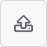

# Data Connect Examples

This repository contains example Data Connect pipelines. To use these pipelines, you will need to either clone this repository or download a ZIP of it.

Once you have the examples on your local computer, you can use Data Connect to import them one at a time.

For example:

1. Login to Experience and launch the Data Connect Designer page from the Integration Designer card.
1. Add a new Package or use an existing package and click on the package name. Note, you will need to create a package name that is not in use by anyone else.
1. Click on the "+ PIPELINE" button to create an new pipeline.
1. Enter a name that is unique. This may need to include your institution name to be unique.
1. Locate and click on the "Import Pipeline" button .
1. Pick the pipeline json file you wish to import.